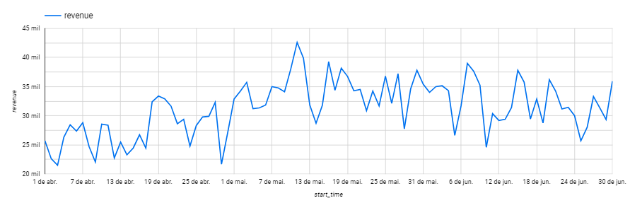
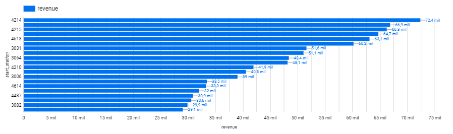
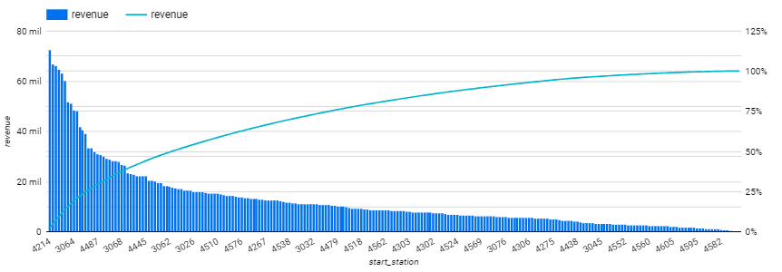
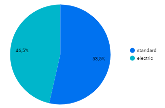
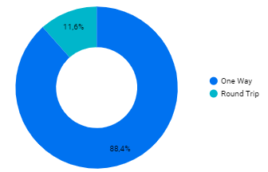
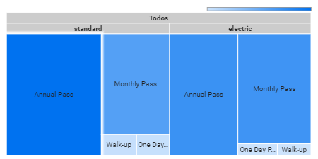
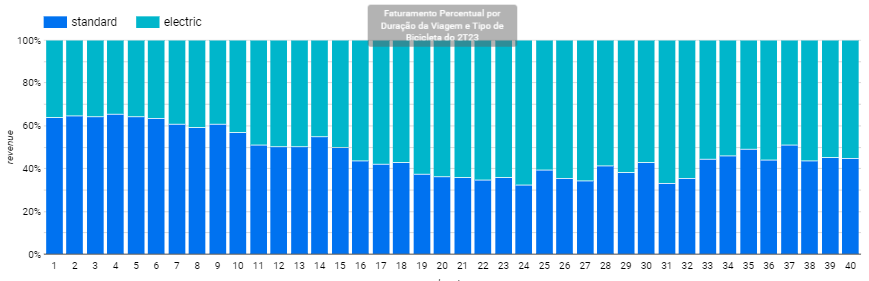

# project-e-hailing
# Problema de negócio
## Descrição
Um empresário quer investir em uma nova empresa no Brasil. Um modelo de negócio que está sendo analisado é o e-hailing (compartilhamento de bicicletas). 
## Objetivo
Para auxiliar na tomada de decisão foi analisado dados do mesmo modelo de negócio, para entender como as bicicletas são usadas em um determinado período de tempo.
# Planejamento da solução
## Conceito Fato-Dimensão
Fato direciona o tipo de resposta que espero obter, objetivo da análise, eventos de negócio, métricas relevantes. 
Dimensão para auxiliar na compreensão de como o Fato de interesse pode ser visto por uma ou mais dimensões.
### Fato 
Entender como as bicicletas são usadas na cidade de Los Angeles.
### Dimensão
| Coluna | Dimensão |                        
| ------- | ------- |
| Trip-id  |Fato |
| Tempo inicial   Tempo Final   Duração da viagem | Tempo |
| Estação inicial   Estação final   Latitude estação inicial   Longitude estação inicial   Latitude estação final   Longitude estação final | Localização |
| Bike id   Duração plano   Categoria rota   Tipo de passe   Tipo de bike | Produto |
## Ferramentas
Para esse projeto foi escolhido a ferramenta Looker da Google para análise e elaboração dos gráficos.
# Insights
#### O faturamento total estimado foi de **$ 2.848.440,5** do modelo de negócio de compartilhamento de bicicleta na cidade de Los Angeles USA, durante o segundo trimestre de 2023. O número total de viagens foi de **109.436** dentro do mesmo período.
 
[Apresentação no Looker Studio](https://lookerstudio.google.com/s/vhlDcw1XjMQ)

### Faturamento diário da Metro Bike do 2T23 ( Gráfico de série temporal )

 
O gráfico acima mostra o crescimento do faturamento da empresa Metro Bike durante o segundo trimestre de 2023. 
No início do mês de abril, observamos um crescimento do faturamento até o final do mês de junho.

### Faturamento por Estação da Metro Bike 2T23 ( Gráfico de barras )

 
O gráfico mostra a distribuição do faturamento pelas estações de permanência das bicicletas.
Observa-se que somente uma estação, identificada pelo número 4214 gera mais de 70 mil em faturamento dentro do período.
Outras cinco estações se destacam pelo faturamento acima de 60 mil dentro o período. 

### Faturamento e Acumulado por Estação da Metro Bike do 2T23 ( Gráfico de combinação )

 
Com o gráfico podemos observar que um pequeno percentual são responsáveis por grande parte do faturamento da empresa. 

### Faturamento por tipo de bicicleta da Metro Bike do 2T23 ( Gráfico de pizza )

 
O gráfico mostra que o faturamento é quase meio a meio pelo tipo de bicicleta.

### Faturamento por tipo de corrida da Metro Bike do 2T23 ( Gráfico de rosca )

 
Observa-se que quase 9 a cada 10 corridas é feito apenas um trajeto.

### Divisão do Faturamento por Tipo e Passe de Bicicleta 2T23 ( Mapa de árvore )

 
O gráfico mostra que nas bicicletas standard a predominância é do passe anual e na bicicleta elétrica é proporcional o passe anual e mensal. Já os passes walk-up e diário tem uma representatividade bem baixa em ambos os tipos de bicicletas.

### Faturamento Percentual por Duração da Viagem e Tipo de Bicicleta do 2T23 ( Gráfico de colunas 100% empilhadas )

 
Observa-se que corridas de até 15 minutos de corrida, a preferência é pela bicicleta standard e depois desse tempo a preferência é pela bicicleta elétrica.

